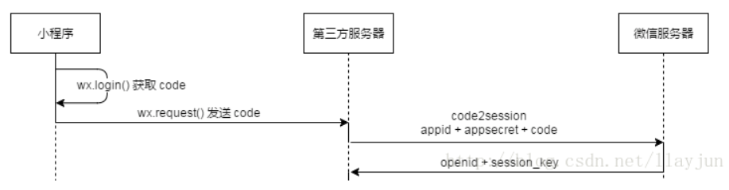

# 轻易在线阅读小程序

## 1、需求分析
* **英语新闻类**阅读小程序较少。
* 现有阅读小程序大多**需要付费**或者是**免费但需要强制性推广**。
* 小程序阅读**可选择范围有限**，并且无法个性化推荐。
  
***

## 2、功能点

### 2.1 主要功能点

* **爬取各大外国新闻网站文章**
  * 一天爬一次
  * 数据存到服务器
  * 对文章进行一定的处理。将基本信息提取出来形成字段。
  * 重点是，看文章涵盖的词汇范围，可能说比较适合入门/初级/娴熟，或者预计花费时间。
  
* 轻触即可**取词翻译**

* **生词本**
  * 简单的温习方式（参考欧陆）
  * 记录词频（查过多少回）
  * 查词扒词典
  
* **测试词汇量**
  * 利用现成的测试工具
  * 获取最后结果
  * 后台记录多次测试结果，做数据展示
  
* **根据词汇量推荐文章**
  * 个性化，针对用户的词汇量/兴趣每天推荐一篇
  * 用户可以选择自己感兴趣的题材
  
* **推荐热门/多人在读/文章**
  * 后台收集读者阅读数据
  * 直接在外文网站上扒热门的
  

### 2.2 辅助功能点
* 收藏
* 已经看过多少词
* 统计阅读记录/浏览
* 阅读榜


***


## 3、相关技术与资料收集

### 3.1 技术概览

* 前端：微信小程序开发全家桶
* 后端：scrapy与django
* 数据库：sqlite
* 辅助：github协同开发


### 3.2 技术文档
* 微信小程序官方文档

  https://developers.weixin.qq.com/miniprogram/dev/index.html
  
* 一条龙服务repo

  https://github.com/justjavac/awesome-wechat-weapp
  
* 小程序登录、获取用户信息、openid和unionid详解

  https://www.daguanren.cc/post/wxlogin_getuserinfo_openid_unionid.html


* 保持登陆状态具体解决办法

  https://www.cnblogs.com/gdutzyh/p/7251432.html


***

## 4、核心技术展示

### 4.1 后端


* 爬虫部分
  * 肉眼观察cnn网站中的**标签元素**，获取**关键信息**（内容/标题/作者等）
  * 在scrapy中编写代码**提取标签元素中的内容**
  * 在获取内容的同时对文本内容做出处理，清洗数据，提取内容
  * 最后将文本**存入本地**（更好的办法是直接将scrapy与django联系起来）

* django部分
  * 将功能**映射**到相应的url上以供调用
  * key points
    * 如何对用户进行标识，并记录登陆状态？
    
    * 对cnn网站访问过于频繁，被网站拒绝访问？
    ```
    IPPOOL=[  
    {"ipaddr":"192.99.203.93"},  
    {"ipaddr":"134.209.73.47"}, 
    {"ipaddr":"167.99.231.73"}, 
    {"ipaddr":"162.243.108.161"}, 
    {"ipaddr":"124.152.32.140"}, 
    {"ipaddr":"61.184.109.33"}]
    ```
    * 框架太庞大，爬取速度慢？
  

### 4.2 前端


***

## 5、效果展示
<div align=center>

### 5.1 主阅读界面


 


### 5.2 单词本


### 5.3 收藏文章


### 5.4 背单词信息


 


### 5.5 单词量测试

 
</div >

## 6、总结


=======
* 三个臭皮匠顶个诸葛亮:)


* 理想很丰满，现实很骨感。技术很酷炫，可惜用不上。


* 利用文档和注释敲定细节hin重要！
```
'''
注意：
1、所有功能均能测试
2、有的参数是通过url直接传递，请务必遵循path第一个参数的格式
3、有的参数是放在request部分，可在代码部分查看（一般就在前几行，形如request.get...）
4、进行用户相关的操作请务必先创建用户
5、404错误一般有可能是url部分错了，没和下面匹配到
6、有bug请务必及时反馈，最好附上截图，方便复现。
7、关于考研/托福/雅思等分类，直接在前端进行判断（根据文章词汇覆盖度最高的一项分类）
8、最近浏览可以直接在前端的缓存中记录/也可以不实现。
'''
urlpatterns = [
    # 单词本
    path('voca_book/<int:op>/<str:uid>/<str:word>/',views.voca_book),   
    # op:0 -- add, 1 -- delete, 2 -- get all words  如果是获取所有单词，在word部分也要随便传个参数(即，word参数不能为空)
    
    # 根据文章id获取内容
    path('get_article_by_id/<int:aid>/',views.getArticleById),  
    
    # 获取历史测试记录
    path('get_test_history/<str:uid>/',views.getRecordHistory), 

    # 存储测试结果/参数如何传递请看代码部分
    path('save_test_res/',views.saveTestRes),
    
    # 获取文章音频
    path('get_audio/<int:aid>/',views.get_mp3),

    # 获取最适合用户阅读的十篇文章
    path('get_top_10/<str:id>/',views.get_similiar)
    ...

```
