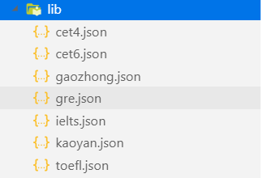

# 轻易在线阅读小程序

## 1、选题原因
* why wechat applets?
  * **英语新闻类**阅读小程序较少。
  * 现有阅读小程序大多**需要付费**或者是**免费但需要强制性推广**。
  * 小程序阅读**可选择范围有限**，并且无法个性化推荐。
  
* why news?
  * 书面化语言，**严谨**，有助于提高阅读能力
  * 紧跟**时事热点**，学习最新表达
  * 涵盖**范围广**，多角度看待问题
  
***

## 2、功能点

### 2.1 主要功能点

* **爬取各大外国新闻网站文章**
  * 一天爬一次
  * 数据存到服务器
  * 对文章进行一定的处理。将基本信息提取出来形成字段。
  
* 轻触即可**取词翻译**
  * 选择合适的查词api接口

* **生词本**
  * 简单的温习方式（参考欧陆）
  * 记录词频（查过多少回）
  * 随时随地背单词
  
* **测试词汇量**
  * 抽样选择测试词汇
  * 根据测试结果记录用户词汇量覆盖范围以及程度
  
* **根据词汇量推荐文章**
  * 针对用户的词汇量/兴趣每天推荐一篇
  * 用户可以按照分类选择自己感兴趣的题材
  
* **收藏文章/查看最近浏览**
  * 记录用户感兴趣的文章
  * 将最近浏览的文章存到缓存
  


***


## 3、相关技术与资料收集

### 3.1 技术概览

* 前端：微信小程序开发全家桶
* 后端：scrapy与django
* 数据库：sqlite
* 辅助：github协同开发


### 3.2 技术文档
* 微信小程序官方文档

  https://developers.weixin.qq.com/miniprogram/dev/index.html
  
* 一条龙服务repo

  https://github.com/justjavac/awesome-wechat-weapp
  
* 小程序登录、获取用户信息、openid和unionid详解

  https://www.daguanren.cc/post/wxlogin_getuserinfo_openid_unionid.html


* 保持登陆状态具体解决办法

  https://www.cnblogs.com/gdutzyh/p/7251432.html


***

## 4、核心技术展示

### 4.1 后端
* 整体业务流程


* example
<div align=center>  



</div>

```
user a:{
    "cet4": 0.48412698412698413, 
    "cet6": 0.05555555555555555, 
    "gaozhong": 0.24603174603174602, 
    "gre": 0.05555555555555555, 
    "ielts": 0.3412698412698413, 
    "kaoyan": 0.31746031746031744, 
    "toefl": 0.07936507936507936
}
news b:{
    "cet4": 0.5355450236966824, 
    "cet6": 0.05687203791469194, 
    "gaozhong": 0.2559241706161137, 
    "gre": 0.05924170616113744, 
    "ielts": 0.3412322274881517, 
    "kaoyan": 0.42890995260663506, 
    "toefl": 0.12559241706161137
}

# 计算欧氏距离
 dist = np.sqrt(np.sum(np.square(sample - np.asarray(c_r_list)))) 
```
* 爬虫部分
  * 肉眼观察cnn网站中的**标签元素**，获取**关键信息**（内容/标题/作者等）
  * 在scrapy中编写代码**提取标签元素中的内容**
  * 在获取内容的同时对文本内容做出处理，清洗数据，提取内容
  * 最后将文本**存入本地**（更好的办法是直接将scrapy与django联系起来）

* django部分
  * 将功能**映射**到相应的url上以供调用
  * key points
    * 如何对用户进行标识，并记录登陆状态？
    
    * 对cnn网站访问过于频繁，被网站拒绝访问？
    ```
    IPPOOL=[  
    {"ipaddr":"192.99.203.93"},  
    {"ipaddr":"134.209.73.47"}, 
    {"ipaddr":"167.99.231.73"}, 
    {"ipaddr":"162.243.108.161"}, 
    {"ipaddr":"124.152.32.140"}, 
    {"ipaddr":"61.184.109.33"}]
    ```
    * 框架太庞大，爬取速度慢？
  

### 4.2 前端
* 多人如何协同开发前端，提高开发效率？👍
    * 利用版本管理工具Git，以及代码托管仓库GitHub，本项目的三个collaborator可以协同push。
    * 组件化开发，每一个界面都是一个独立的组件

* 轻触即可**取词翻译** 🤐
    * 用户长按不是可以调用系统底层函数来查词么，此功能是否显得多余？(+_+)?

        答：系统底层的词典识别，需要用户长按耗时比较长。而且再阅读英文文章的时候，查阅生词比较频繁，此功能只需要用户轻触就可查词(⓿_⓿)，所以此功能能极大的改善用户体验。
    * 实现此功能的思路的关键词？🙃
        * 后端文本分词
        * 前端每个单词API绑定

* 推荐文章及热点文章界面显示
    * 界面组件化：Wepy，WeUI，IViewUI组件库
    * 文章概要预览：
        * 难度等级（四六级、考研、托福、GRE）
        * 文章类别（Education、Science、Life）
        * 标题
        * 文章字数
        * 文章阅读人数（mock数据）

* 页面懒加载与解决小程序异步数据不同步的问题
    * 小程序中的网络请求是异步实现机制，如何解决需要同步请求数据渲染的请求？
    
        解决方案：Pormise化，所有的请求必须等待promise完成后进行then操作

    * 页面懒加载
        
        渲染更快

* 查词接口
    
    * 有道Restful Web API
        * 单词的考试等级
        * 发音，释义
    * 扇贝API
        
        * 大量双语例句获取

* 图形化组件库
   
    * wxcharts
    
    


* 

***

## 5、效果展示
<div align=center>

### 5.1 主阅读界面


 


### 5.2 单词本界面


### 5.3 收藏文章界面


### 5.4 背单词界面


 


### 5.5 单词量测试界面

 

### 5.6 文章推荐主界面


</div >

## 6、总结

* 三个臭皮匠顶个诸葛亮:)


* 理想很丰满，现实很骨感。技术很酷炫，可惜用不上。
  


* 利用文档和注释敲定细节hin重要！
```
'''
注意：
1、所有功能均能测试
2、有的参数是通过url直接传递，请务必遵循path第一个参数的格式
3、有的参数是放在request部分，可在代码部分查看（一般就在前几行，形如request.get...）
4、进行用户相关的操作请务必先创建用户
5、404错误一般有可能是url部分错了，没和下面匹配到
6、有bug请务必及时反馈，最好附上截图，方便复现。
7、关于考研/托福/雅思等分类，直接在前端进行判断（根据文章词汇覆盖度最高的一项分类）
8、最近浏览可以直接在前端的缓存中记录/也可以不实现。
'''
urlpatterns = [
    # 单词本
    path('voca_book/<int:op>/<str:uid>/<str:word>/',views.voca_book),   
    # op:0 -- add, 1 -- delete, 2 -- get all words  如果是获取所有单词，在word部分也要随便传个参数(即，word参数不能为空)
...

```
