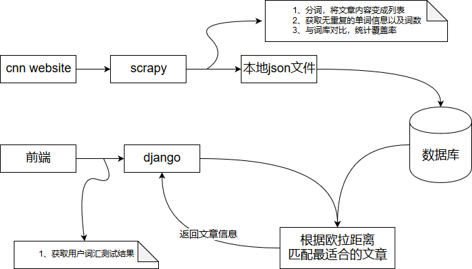
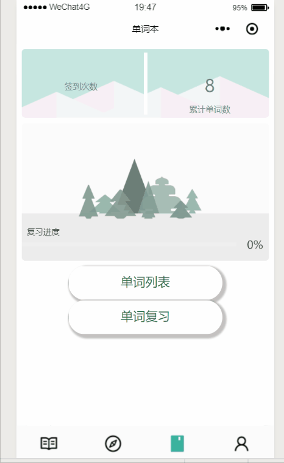
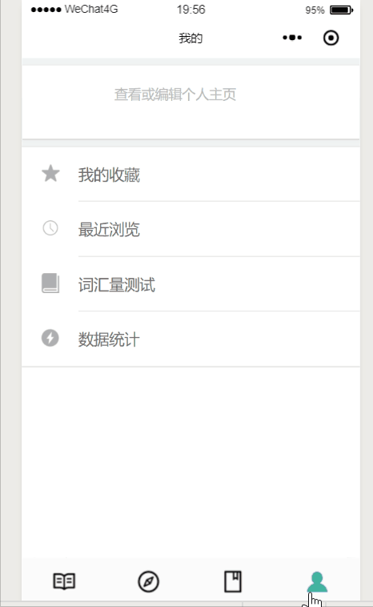
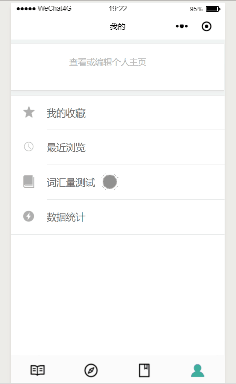
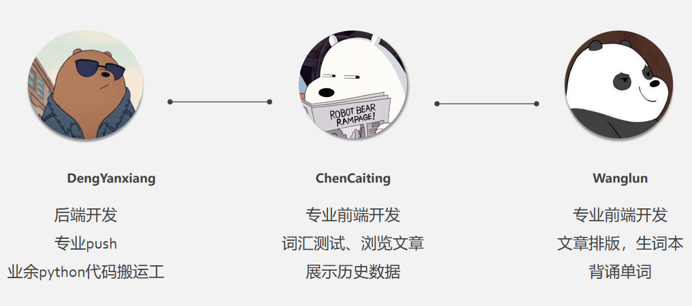

# 轻易在线阅读小程序

## 1、需求分析
* **英语新闻类**阅读小程序较少。
* 现有阅读小程序大多**需要付费**或者是**免费但需要强制性推广**。
* 小程序阅读**可选择范围有限**，并且无法个性化推荐。
  
***

## 2、功能点
### 2.1 主要功能点
* **测试词汇量**
  * 利用现成的测试工具
  * 获取最后结果
  * 后台记录多次测试结果，做数据展示
* **根据词汇量推荐文章**
  * 个性化，针对用户的词汇量/兴趣每天推荐一篇
  * 用户可以选择自己感兴趣的题材
* 根据类别/难度选择文章
  * 涉及对文章难度评级
  * 边爬边分类
* **生词本**
  * 简单的温习方式（参考欧陆）
  * 记录词频（查过多少回）
  * 查词扒词典
* **爬取各大外国新闻网站文章**
  * 一天爬一次
  * 数据存到服务器
  * 对文章进行一定的处理。将基本信息提取出来形成字段。
  * 重点是，看文章涵盖的词汇范围，可能说比较适合入门/初级/娴熟，或者预计花费时间。
* **推荐热门/多人在读/文章**
  * 后台收集读者阅读数据
  * 直接在外文网站上扒热门的
* 轻触即可**取词翻译**

### 2.2 辅助功能点

* 收藏
* 已经看过多少词
* 统计阅读记录/浏览
* 阅读榜

***

## 3、相关技术与资料收集
### 3.1 技术概览
* 前端：微信小程序开发全家桶
* 后端：scrapy与django
* 数据库：sqlite
* 辅助：github协同开发

### 3.2 技术文档
* 微信小程序官方文档

  https://developers.weixin.qq.com/miniprogram/dev/index.html
  
* 一条龙服务repo

  https://github.com/justjavac/awesome-wechat-weapp
  
* 小程序登录、获取用户信息、openid和unionid详解

  https://www.daguanren.cc/post/wxlogin_getuserinfo_openid_unionid.html

* 保持登陆状态具体解决办法

  https://www.cnblogs.com/gdutzyh/p/7251432.html

  https://www.jianshu.com/p/2af0d2e9f375

  http://djangobook.py3k.cn/2.0/chapter14/
  

***

## 4、核心业务说明
### 4.1 推荐文章

***

## 5、效果展示

### 5.1 主阅读界面

 

### 5.2 单词本

### 5.3 收藏文章

### 5.4 背单词信息

 

### 5.5 单词量测试

 

## 6、总结

